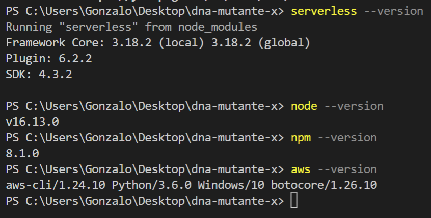
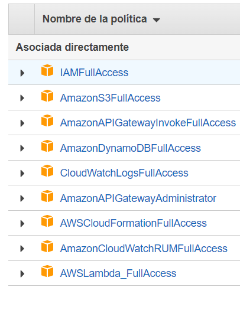
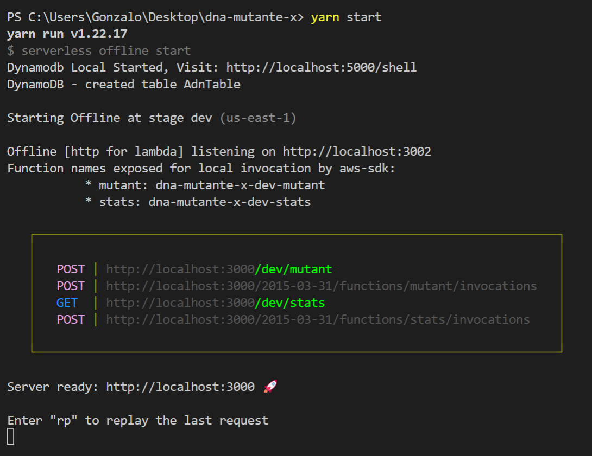
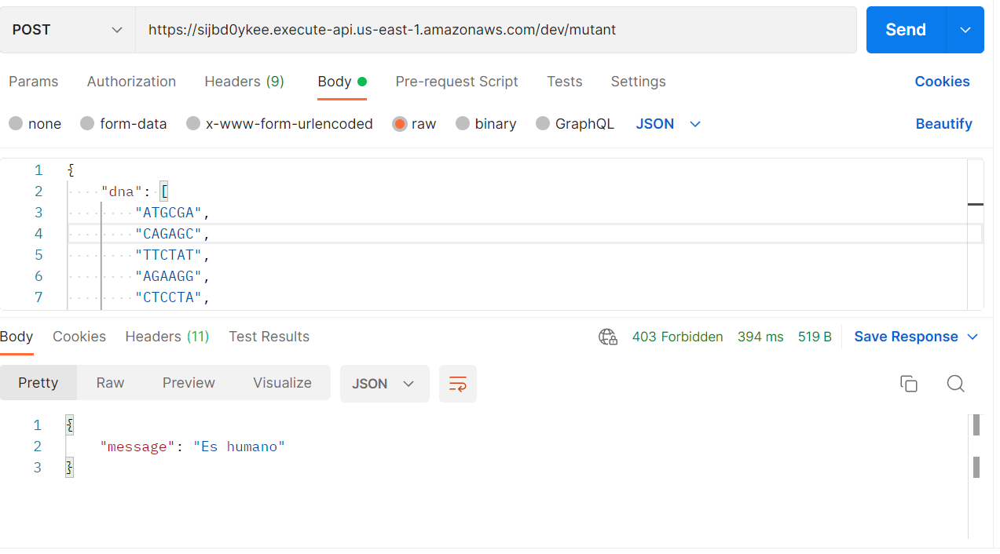
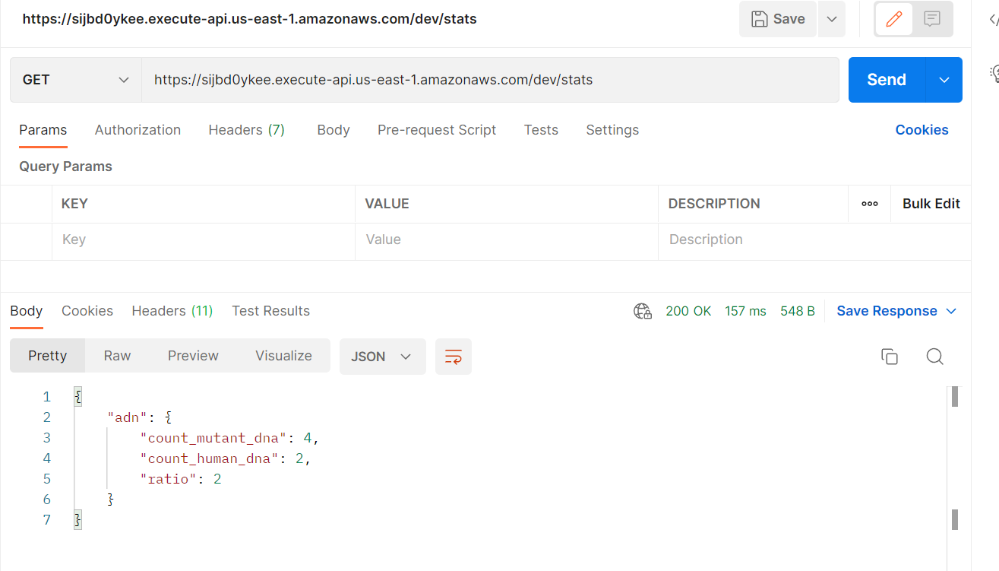
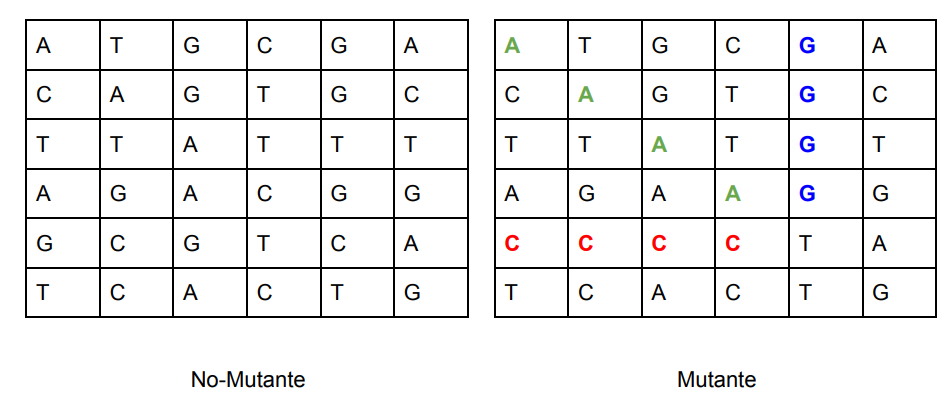
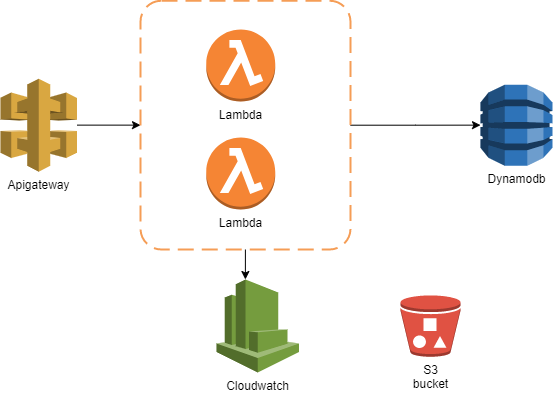

# Serverless Framework + Typescript + AWS

> Se muestra cómo se resuelve el reto X-MEN detención de ADN usando Serverless Framework + Typescript + AWS

## Configurar ambiente
### 01- Instalar
- Node >= 14.X 
https://nodejs.org/es/download/ 

- Serverless Framework

```
npm install -g serverless 
```

- aws cli (opcional por si quiere desplegar la infraestructura)
https://aws.amazon.com/es/cli/ 

### 02 - Validación de instalación 
- serverless –version
- node –version
- npm –version 
- aws –version 



### 03 - Clone el proyecto 
- git clone https://github.com/gonzaloperezbarrios/x-men.git

### 04 - Paquetes

> Ubíquese en la raíz del proyecto e instale los paquetes

- npm install o yarn
### 05 - Instale la base de datos local DynamoDB
- serverless dynamodb install
### 06 - Conectese AWS CLOUD (opcional por si quiere desplegar la infraestructura)
- aws configure
- serverless config credentials --provider aws --key <KEY> --secret <SECRET>

**Nota**: Asegúrese de tener los permisos suficientes 



## Como correr la aplicación 
- npm run start o yarn start



## Como desplegar la aplicación
- npm run deploy o yarn deploy

## Como usar el  API 

- Crear un registro:

	- **Método:** POST
	- **URL - LOCAL :**  http://localhost:3000/dev/mutant  
	- **URL - PRODUCTIVA:**  https://sijbd0ykee.execute-api.us-east-1.amazonaws.com/dev/mutant  
	- **BODY:**
```
    {    
	    "dna": [ "ATGCGA","CAGAGC","TTCTAT","AGAAGG","CTCCTA","TCACTG"]
    }
```



- Obtener estadistica: 
	- **Método:** GET
	- **URL - LOCAL :**  http://localhost:3000/dev/stats
	- **URL - PRODUCTIVA:**  https://sijbd0ykee.execute-api.us-east-1.amazonaws.com/dev/stats



## Estructura del Proyecto 

```
.
├── src
│ │ ├── application # Donde se encuentra la lógica de segundo grado, es decir de validaciones apoya la lógica de negocio, por ejemplo; validaciones, accesos a datos crudos, reportes
│ │ ├── domain # Donde se encuentra las reglas de negocio
│ │ ├── infraestructure # Donde se encuentra los recursos que no hace parta del negocio, por ejemplo; conexiones a base de datos, llamado a APIS de tercero.
│ ├── functions # Lambda - carpeta de configuración y código fuente
│ │ ├── mutant
│ │ │ ├── handler.ts # `mutant` lambda - código fuente
│ │ │ ├── index.ts # `mutant` lambda Serverless - configuración
│ │ │ ├── mock.json # `mutant` lambda - parámetro de entrada, si lo hay, para la invocación local
│ │ │ └── schema.ts # `mutant` lambda - evento de entrada JSON-Schema
│ │ │
│ │ └── index.ts # Import/export de todas las configuraciones lambda
│ │
│ └── libs # Lambda shared code
│ └── apiGateway.ts # API Gateway specific helpers
│ └── handlerResolver.ts # Sharable library for resolving lambda handlers
│ └── lambda.ts # Lambda middleware
│
├── package.json
├── serverless.ts # Serverless service file
├── tsconfig.json # Typescript compiler configuration
├── tsconfig.paths.json # Typescript paths
└── webpack.config.js # Webpack configuration
```

## RETO - IDENTIFICAR ADN MUTANTE
> “Magneto quiere reclutar la mayor cantidad de mutantes para poder luchar contra los X-Men. 
Te ha contratado a ti para que desarrolles un proyecto que detecte si un humano es mutante basándose en su secuencia de ADN.

> En donde recibirás como parámetro un array de Strings que representan cada fila de una tabla de (NxN) con la secuencia del ADN. Las letras de los Strings solo pueden ser: (A,T,C,G), las cuales representa cada base nitrogenada del ADN.

> Sabrás si un humano es mutante, si encuentras más de una secuencia de cuatro letras iguales, de forma oblicua, horizontal o vertical.”



## Solución 
> Para el desarrollo de este reto se consideró las siguientes tecnologías: 

### Código Fuente: 
- **Serverless Framework con Typescript:** Este Framework nos facilita probar y desplegar el código fuente en aws (cualquier otro proveedor de nube), como también crear la infraestructura como código. 

- **Jest:** Este Framework nos facilita la implementación de pruebas unitarias y conocer nivel de cobertura. 
- **Eslint:** Este plugin nos ayuda dando recomendaciones de escritura de código. 

### Infraestructura AWS

- **Apigateway:** Servicio donde expone el API-REST y enlaza con las funciones lambdas
- **Lambda:** Servicio donde esta desplegado el código fuente 
- **Cloudwatch:** Servicio donde queda registro de los logs de las notificaciones de las lambdas
- **Dynamodb:** Base de datos no relacional 
- **S3 bucket:** Servicio donde queda depositado los despliegues.


